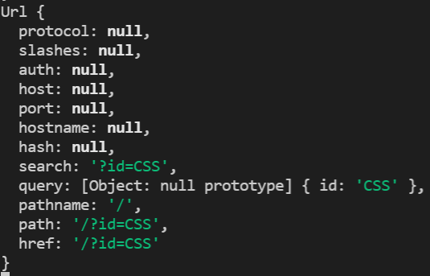

### 이전코드에서
```js
if(_url == '/'){
  title = 'Welcome';
}
if(_url == '/favicon.ico'){
  return response.writeHead(404);
}
```
이 부분 삭제


### id값이 없는 주소로 접근 시 오류 메시지를 사용자에게 전송
```js
console.log(url.parse(_url, true));
```
를 출력해보면 아래와 같이 주어진 url 정보를 분석하여 이런식으로 정보를 쉽게 쓸 수 있도록 도와준다.


path는 queryString이 포함되어있고,
pathname는 queryString이 실제 주소에 있다고 하더라도 queryString이 아닌 path만을 보여주는 차이점 존재.
queryString이란 ?뒷부분을 말한다.

필요한 부분은 현재 path를 나타내는 pathname 부분이므로 
```js
if(pathname == '/'){

}
```
로 알맞은 주소인지 확인한 다음, 아니라면 오류 메시지를 띄워준다.
```js
else {
  response.writeHead(404);
  response.end('Not found');
}
```

여기서 **response.writeHead(~~~);** 란
웹브라우저가 웹서버에 접속했을 때 웹서버가 응답을 하는데, 그 사이에서 잘 됐는지, 에러가 있는지 등을 기계와 기계의 통신에서 나타내는 간결한 약속이다.
- 200 : 서버가 브라우저에게 200이라는 숫자를 주면 파일을 성공적으로 전송했다.
- 404 : 파일을 찾을 수 없을 때 웹서버가 404라는 숫자를 돌려줌.

---
home도 pathname은 /이고, /?id=CSS 도 pathname은 /이다.
```js
if(pathname === '/')
```
으로는 home과 각 페이지를 구분할 수 없다.
-> 반복문을 중첩 사용하여 해결

queryData.id에서 둘의 경우 차이가 나는데, home에서는 undefined가 반환이 되고, 다른 페이지에서는 CSS, HTML등이 반환된다.
- undefined : 정의되지 않은 데이터를 의미. 없는 주소 호출 시 반환

```js
if(pathname === '/'){
  if(queryData.id === undefined){
  }
}
```
이런 형식으로 사용하여 해결하였다.
