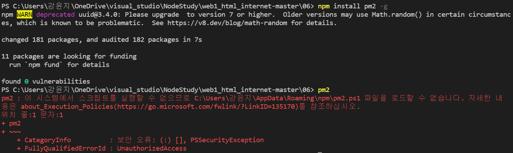

[readFileSync vs readFile](#readfilesync_vs_readfile)
[callback](#callback)
[Package Manager](#package-manager)

## readFileSync vs readFile
1) fs.readFileSync(path[, options])
- 동기적인 방식으로 진행
- return 값 존재

2) fs.readFile(path[, options], callback)
- 비동기적인 방식
- callBack 존재
- return 값 없음. 대신 함수를 세번째 인자로 준다.
- node.js가 path의 파일을 읽는 작업이 끝나면 callback으로 준 함수를 node.js가 실행시키면서 첫번째 인자에는 error가 있다면 error를 인자로 제공, 두번째 파라미터에는 파일의 내용을 인자로 공급해주도록 한다.

---

## callback
callback이란 
js에서 함수는 object이다. 그렇기에 함수는 다른 함수의 인자로 쓰일 수도, 어떤 함수에 의해 return 될 수도 있다.
이러한 함수를 고차함수(higher-order functions)라고 하고, 인자로 넘겨지는 함수를 callback함수라고 한다.
즉, **다른 함수에 매개변수로 넘겨준 함수이며, 매개변수로 넘겨받은 함수는 일단 넘겨받고, 때가 되면 나중에 호출(callback) 한다.**
- 고차함수 : 함수를 인자로 받거나 또는 함수를 반환함으로써 작동하는 함수.

 ```js
 function a() {
  console.log('A');
}
```
이 함수를

 ```js
var a = function() {
  console.log('A');
}
```
이렇게 이름이 없는 함수를 익명함수라고 한다.
a라는 변수의 값으로써 함수 존재
js에서는 함수는 값이라는 것을 의미! (???)
```js
a();
```
이렇게 a라는 변수 뒤에 함수를 호출하는 () 기호를 놓는 것을 통해 a라는 변수가 담고 있는 값인 함수를 실행할 수 있다.

이 a라는 함수를 
```js
var a = function() {
  console.log('A');
}
function slowfunc(callback){
  callback();
}
slowfunc(a);
```
이런식으로 slowfunc()의 callback함수로 사용할 수 있다.

---

## Package Manager

package라는 것은 sw를 부르는 여러가지 용어 중 하나
독립적으로 실행되는 프로그램, 어떤 프로그램 안에서 부품으로 사용되는 작은 프로그램도 package라고 할 수 있다.
package manager는 그러한 sw를 관리해주는,(create, install, update, delete) 프로그램이다.
각각의 컴퓨터 언어와 운영체제 별로 package manager는 굉장히 중요한 역할을 하고 있다.
앞으로 볼 것은 npm이라는 node.js에서 광범위하게 사용되고 있고 node.js를 설치 시 함께 설치되는 package manager이다.

그 중 하나가 
pm2라는 패키지
실행중인 프로그램(node.js를 통해 만든 프로그램= 여기선 main.js)을 실행해서 동작을 시키다 보면 어떤 이유로 인해 원하지 않는 순간에 프로그램이 꺼질 수 있다. 그럼 서비스가 안된다! pm2와 같은 프로그램이 우리가 만든 process(프로그램)을 감시하고 있다가 꺼지면 다시 켜주는 역할도 하고
지금까지는 코드를 수정하면 node.js를 껐다 다시 실행시켜야지만 변경된 내용이 반영이 됐는데 pm2가 파일이 수정되는지를 관찰하고 있다가 파일이 수정되면 자동으로 프로그램을 껐다 다시 켜서 수정할 떄 마다 껐다 키는 불편함을 제거해준다.
-> npm을 이용해 pm2를 설치하여 사용해보자!

설치 방법
```
npm install pm2 -g
```
-g: 설치하는 프로그램은 독립된 소프트웨어라서 이 컴퓨터 어디에서든지 사용할 수 있어야 한다.

실행방법
```js
pm2 start app.js
```

**여기서 문제 발생**
pm2가 잘 설치됐는지 확인해보았는데 다음과 같은 에러메시지가 출력되었다.


이는 window 실행환경에서 스크립트 실행권환이 제한되어 있는 상태이기 때문이다.
이 문제는 
https://singa-korean.tistory.com/21
여기를 따라하여 해결하였다.