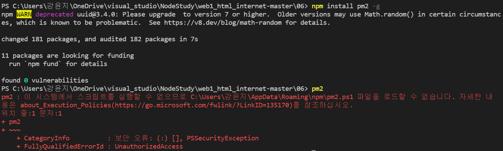
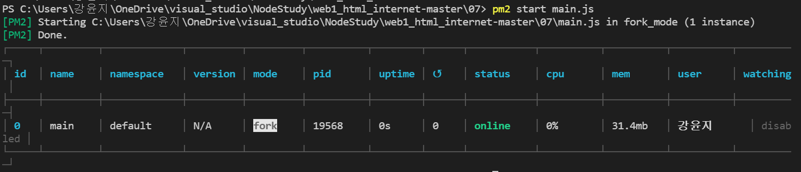
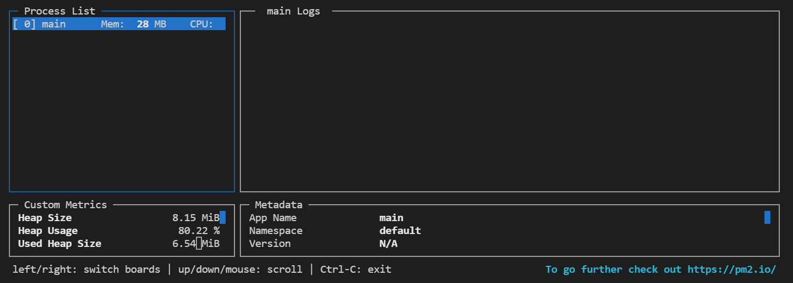
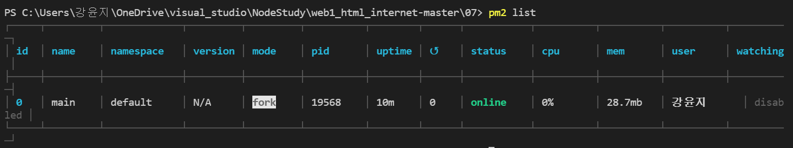
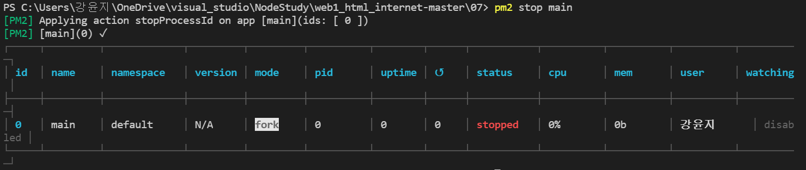

[Package Manager](#package-manager)

## Package Manager

package라는 것은 sw를 부르는 여러가지 용어 중 하나
독립적으로 실행되는 프로그램, 어떤 프로그램 안에서 부품으로 사용되는 작은 프로그램도 package라고 할 수 있다.

package manager는 그러한 sw를 관리해주는,(create, install, update, delete) 프로그램이다.

각각의 컴퓨터 언어와 운영체제 별로 package manager는 굉장히 중요한 역할을 하고 있다.

앞으로 볼 것은 npm이라는 node.js에서 광범위하게 사용되고 있고 node.js를 설치 시 함께 설치되는 package manager이다.
---
그 중 하나가 pm2라는 패키지
실행중인 프로그램(node.js를 통해 만든 프로그램= 여기선 main.js)을 실행해서 동작을 시키다 보면 어떤 이유로 인해 원하지 않는 순간에 프로그램이 꺼질 수 있다. 그럼 서비스가 안된다! pm2와 같은 프로그램이 우리가 만든 process(프로그램)을 감시하고 있다가 꺼지면 다시 켜주는 역할도 하고

지금까지는 코드를 수정하면 node.js를 껐다 다시 실행시켜야지만 변경된 내용이 반영이 됐는데 pm2가 파일이 수정되는지를 관찰하고 있다가 파일이 수정되면 자동으로 프로그램을 껐다 다시 켜서 수정할 떄 마다 껐다 키는 불편함을 제거해준다.

-> npm을 이용해 pm2를 설치하여 사용해보자!
---
- 설치 방법
```
npm install pm2 -g
```
-g: 설치하는 프로그램은 독립된 소프트웨어라서 이 컴퓨터 어디에서든지 사용할 수 있어야 한다.


**여기서 문제 발생**

pm2가 잘 설치됐는지 확인해보았는데 다음과 같은 에러메시지가 출력되었다.


이는 window 실행환경에서 스크립트 실행권환이 제한되어 있는 상태이기 때문이다.
이 문제는 아래의 주소의 내용을 따라하여 해결하였다.
https://singa-korean.tistory.com/21
---
- 실행방법
```js
pm2 start main.js
```

두번째 행의 main이란 지금 실행시킨 main.js의 별명

status가 online : 지금 실행중 

cpu와 memory도 지금 얼마나 소비하고 있는지도 화면에 보여준다.

이 상태가 지금 main.js가 실행 된 상태이다.
---
- monitoring
```js
pm2 monit
```

현재 실행되고 있는 pm2에 의해 실행되고 있는 프로그램들이 보인다.

이 화면에서 나가고 싶으면 **q** 입력
---
- 현재 실행중인 프로세스의 list 확인
```js
pm2 list
```


---

- 프로그램 종료

pm2 list를 통해 목록을 본 다음 종료하고 싶은 프로세스의 이름이 main이라는 것을 확인했으면 
```js
pm2 stop main
```

이렇게 main이 꺼지면서 stoped라고 status가 변경되는 것을 확인할 수 있다.

---

pm2가 프로그래머가 소스코드를 변경했을 때 자동으로 main.js를 껐다 키기 때문에 프로그래머가 직접 수정할 때 마다 껐다 키는 불편함을 감수하지 않아도 된다!

```js
pm2 start main.js --watch
```

**node main.js**로 실행하면 문제가 있으면 화면에 바로바로 보여줬는데, 위의 방법은 그렇지 않다.

```js
pm2 log
```
를 입력하면 어떠한 문제가 있을 때 그 문제점을 화면에 바로 보여준다.